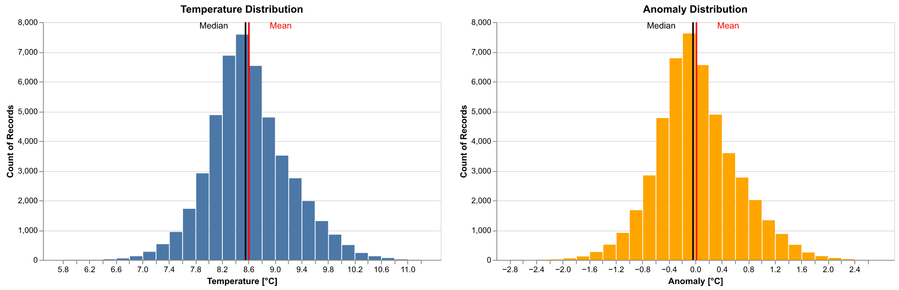
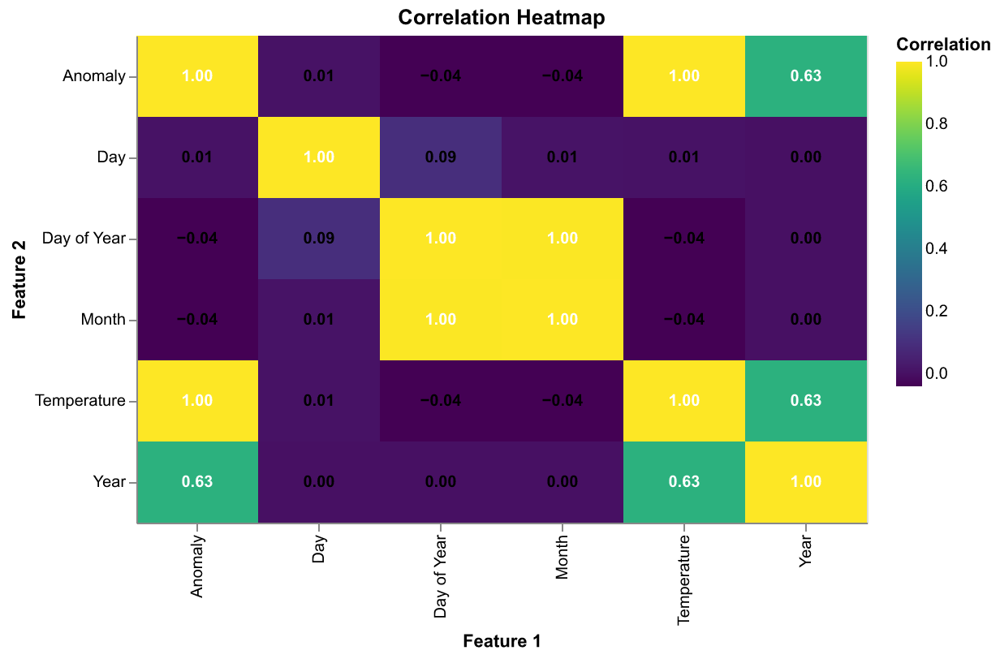
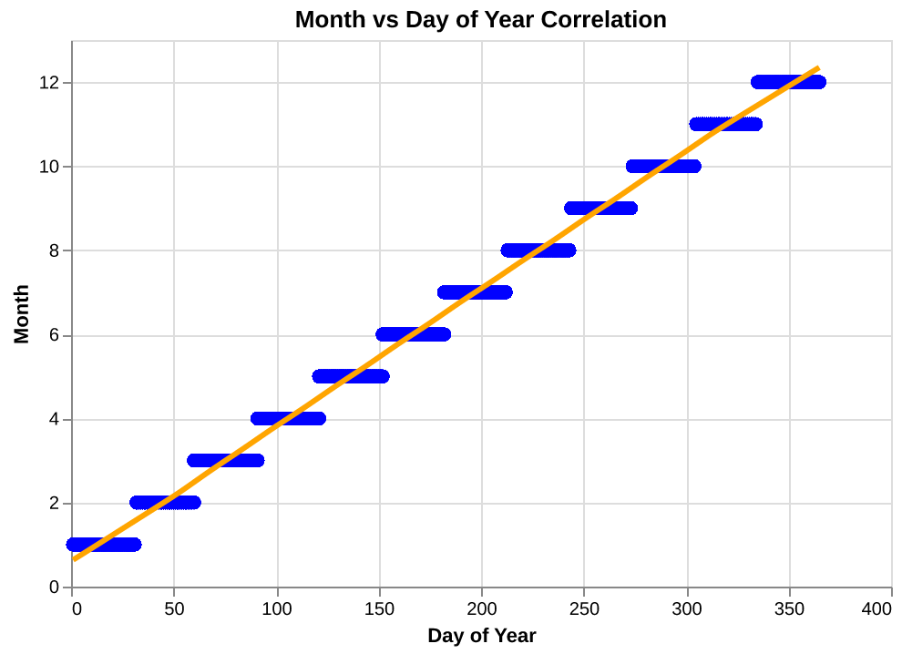
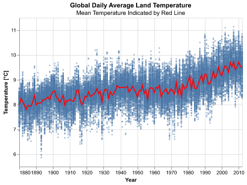
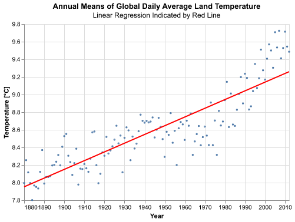
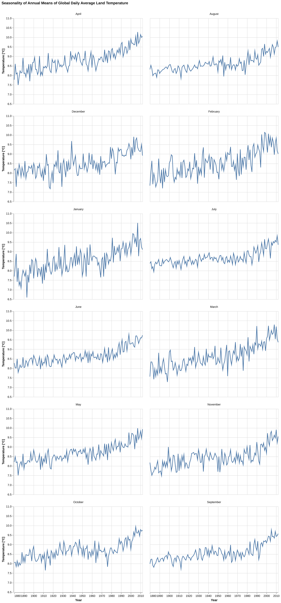
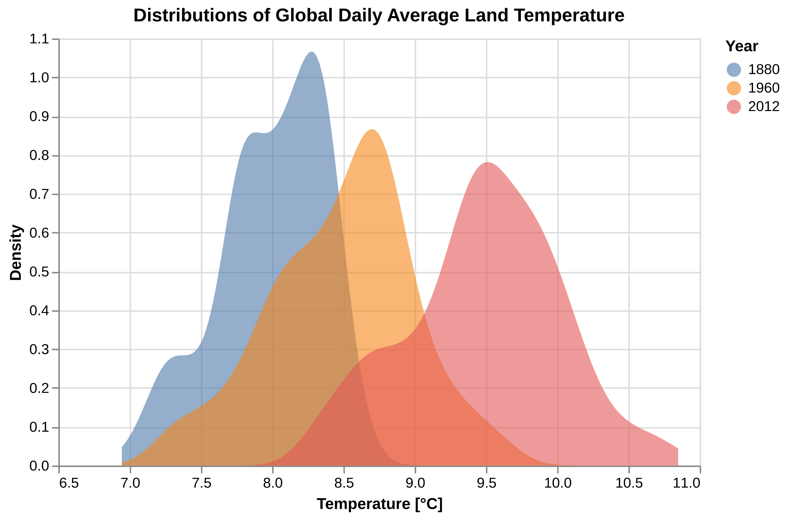
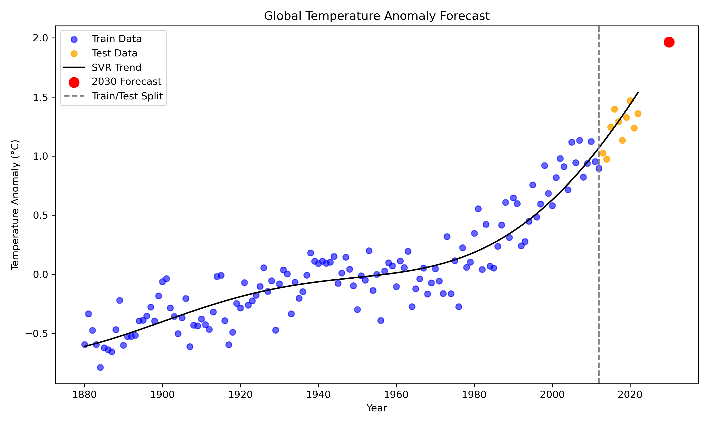

# Summary

This project analyzes global daily average land-surface temperature measurements collected by Berkeley Earth from 1880–2022. In the following analysis, dataset is cleaned and preprocessed, explored through EDA, and modeled to predict future temperature trends using this historical data. After evaluating three regression approaches, Linear Regression, Random Forest, and Support Vector Regression (SVR),the SVR model performed best and was used to forecast the land average temperature for the year 2030.

# Introduction

Understanding long-term changes in global land temperature is critical for studying climate change. Daily temperature anomaly data collected over more than 140 years provide an opportunity to model how temperatures have shifted, identify long-term patterns, and forecast future warming.

In this report, we talk both about the actual temperature as well as the temperature anomaly. Temperature anomaly refers to deviation from a baseline climatological temperature. In this study, the baseline is 8.59°C, representing the January 1951–December 1980 global land-average temperature. 

In this project, we will be answering the research question:

What do we expect the global land-average temperature of the Earth to be in 2030, based on the trends from the years 1880 to 2012.

## Dataset
The data set for this project was published by Berkeley Earth under a Creative Commons BY-NC 4.0 International license, free for non-commercial use, and accessed by our team compliant with the conditions in this license on November 18, 2025. The raw data can be found at the [Berkeley Earth Temperature site](https://berkeley-earth-temperature.s3.us-west-1.amazonaws.com/Global/Complete_TAVG_daily.txt) [@Berkeley_data].

The data set contains 5 columns with time series information, and one column representing the temperature difference relative to the average temperature between January 1951 and December 1980, which they calculated as 8.59 +/- 0.05 [@Berkeley_data]. For our analysis, we preprocessed the data to get the raw temperature readings back by adding 8.59 to each entry in the Anomaly column. All temperatures are in Celsius.

# Methods and Results

The Python programming language [@Python] and the following Python packages were used to perform the analysis: pandas [@pandas], altair [@altair], click [@click], matplotlib [@matplotlib], numpy [@numpy], scikit-learn [@sklearn], pandera [@pandera], as well as Quarto [@Allaire_Quarto_2022].

```{python}

# Importing the required libraries. Execution Time Note: 
# It may take up to 30 seconds to load in the libraries on the first run through.

# -----------------------------
# Data Handling & Numerical Computation
# -----------------------------
import pandas as pd      # DataFrames for data manipulation
import numpy as np       # Numerical computations and array operations
import os                # OS-level operations (paths, environment variables)

# -----------------------------
# Visualization Libraries
# -----------------------------
import matplotlib.pyplot as plt  # Classic plotting library
import altair as alt             # Interactive, declarative plots for EDA
from IPython.display import Markdown, display # Render tables nicely in qmd

# -----------------------------
# Machine Learning Models & Utilities
# -----------------------------
from sklearn.linear_model import LinearRegression        # Simple linear regression
from sklearn.ensemble import RandomForestRegressor       # Ensemble method for regression
from sklearn.svm import SVR                               # Support Vector Regression
from sklearn.preprocessing import StandardScaler          # Feature scaling
from sklearn.pipeline import Pipeline                     # Pipeline for sequential transformations
from sklearn.metrics import mean_squared_error, mean_absolute_error, r2_score
                                                        # Model evaluation metrics

# -----------------------------
# Data Validation
# -----------------------------
import pandera.pandas as pa     # Pandera DataFrame validation
from pandera import Column, Check  # Column-level validation

# -----------------------------
# Logging & Warnings
# -----------------------------
import warnings    # Issue runtime warnings without stopping execution
import logging     # Logging errors or informational messages
import json        # Convert validation errors or logs to JSON format

# Create logs directory to hold validation logs
logs_folder_path = "../logs"
if not os.path.exists(logs_folder_path):
    os.makedirs(logs_folder_path)

# Configure logging
logging.basicConfig(
    filename=f"{logs_folder_path}/validation_errors.log",
    filemode="w",
    format="%(asctime)s - %(message)s",
    level=logging.INFO,
)

# Simplify Working with Large Datasets 
alt.data_transformers.enable('vegafusion')

# Ignore all warnings from the altair package for pdf rendering, warnings validated first
# resource for implementation:
# https://stackoverflow.com/questions/3920502/how-to-suppress-a-third-party-warning-using-warnings-filterwarnings
warnings.filterwarnings('ignore', module='altair')
# suppress verbose pandera warning for ipynb and pdf rendering
warnings.filterwarnings('ignore', module='pandera')

# Configure Plot Sizes for pdf (D.R.Y)
plot_size = {'width': 450, 'height': 300}
facet_plot_size = {'width': 250, 'height': 200}
```

## Pandera Schema for Daily Temperature Data Validation

The Pandera schema applied to the input data defines the expected structure and quality checks for the daily temperature dataset. It enforces correct column names, validates data types (e.g., integers for dates, floats for temperature values), ensures month names follow the expected categories, checks that values fall within reasonable ranges (year, month, day, day-of-year), and confirms that no duplicate rows are present. Unexpected columns from slipping in into the data was prevented in the schema, and compatible types when were converted when possible.

```{python}
# Adapted from https://github.com/skysheng7/DSCI522_data_validation_demo/tree/main/notebooks


# ------------------------------------------------------------
# Expected Column Names in Correct Order
# Used as a reference to ensure dataset structure is correct.
# ------------------------------------------------------------
expected_columns = [
    "Year", "Month", "Day", "Day of Year",
    "Anomaly", "Temperature", "Month_Name"
]

# ------------------------------------------------------------
# Pandera Data Validation Schema for Daily Temperature Dataset
# This schema verifies:
# - Columns exist and are correctly typed
# - Date values are within realistic bounds
# - Month names match expected categories
# - No missing values in critical columns
# - No duplicate rows
# - No extra or unexpected columns appear
# ------------------------------------------------------------
DailyTempSchema = pa.DataFrameSchema(

    # --------------------------------------------------------
    # COLUMN DEFINITIONS
    # Each column has:
    # - A required Python/NumPy dtype
    # - Optional value-range checks
    # - `nullable=False` ensures no missing values allowed
    # --------------------------------------------------------
    columns = {

        # Year should be a reasonable calendar year.
        "Year": Column(int, Check.in_range(1800, 2100), nullable=False),

        # Month must be between 1–12.
        "Month": Column(int, Check.in_range(1, 12), nullable=False),

        # Day of month must be between 1–31.
        "Day": Column(int, Check.in_range(1, 31), nullable=False),

        # Day of Year must be between 1–366.
        "Day of Year": Column(int, Check.in_range(1, 366), nullable=False),

        # Data Collection Limits for Target and Transformed Target based on
        # minimum and maximum value of baseline temp (our data is the average)  
        # Limits this high should never be practically seen in the date range
        # (min baseline temp - avg baseline temp, max baseline temp - avg baseline temp)
        "Anomaly": Column(float, Check.in_range(-5.64, 5.81), nullable=False),

        # Temperature = Anomaly + BASELINE, so numeric
        # range obtained from resources cited below, see explanation
        "Temperature": Column(float, Check.in_range(2.95, 14.40), nullable=False),

        # Month names must exactly match the expected categorical list.
        "Month_Name": Column(
            str,
            Check.isin([
                'January','February','March','April','May','June',
                'July','August','September','October','November','December'
            ]),
            nullable=False
        ),
    },

    # --------------------------------------------------------
    # DATAFRAME-WIDE CHECKS
    # Ensures no duplicated rows exist.
    # --------------------------------------------------------
    checks = [
        Check(lambda df: df.drop_duplicates().shape[0] == df.shape[0])
    ],

    # --------------------------------------------------------
    # STRICT MODE
    # Ensures **no extra/unexpected columns** are allowed.
    # --------------------------------------------------------
    strict=True,

    # --------------------------------------------------------
    # COERCE MODE
    # Automatically converts data types if possible.
    # Eg: "2020" → 2020 if dtype=int is required.
    # --------------------------------------------------------
    coerce=True
)
```

The allowable limits for outliers on the average temperature anomaly dataset relative to the average baseline (estimated Jan. 1951 - Dec. 1980 absolute temperature with reported 95% confidence bounds [@Berkeley_data]), were naturally set as the minimum and maximum measurements of the baseline itself, or in other words the minimum and maximum temperature anomalies observed. These are reasonable limits for the averaged values because you would not expect the averaged values to be anywhere near the absolute minimum and maximum measurements, and if they are these examples should be examined more carefully (raising a validation warning or viewing the validation error log). Because the baseline, temperature in Celsius and temperature anomaly all have a direct mathematical relationship, bounds can be set on the anomaly target or temperature target interchangeably by adding or subtracting the average baseline (8.59). The resulting average anomaly limits were -5.64 and 5.81, which were compared to external sources to ensure validity. 

The sources [@Berkeley_TMIN; @Berkeley_TMAX; @Hansen_2012; @Hansen_2022] (which use the same 1951-1980 baseline for average temperature anomaly) demonstrate that a deviation of temperature anomaly by more than 5 degrees Celsius from the baseline is extremely rare, and only observed for certain monthly averages of anomaly temperature taken across specific regions: "It was unusually warm in the Southeast U.S. and Greenland in December, the monthly average anomaly exceeding +5°C (+9°F) (Fig. 3)"[@Hansen_2012]. Since our dataset involves average temperature anomalies globally, an anomaly this large in magnitude entering the training dataset should be flagged in the validation stage, examined further and potentially discarded.

```{python}
url = "https://berkeley-earth-temperature.s3.us-west-1.amazonaws.com/Global/Complete_TAVG_daily.txt"

'''
read the data from the url link
ignore the comments starting with '%'
ignore the header in the comments and assign manually
'''
df = pd.read_csv(url, sep=r"\s+", comment="%", header=None)

# assign column headers
column_names = ["Date Number", "Year", "Month", "Day", "Day of Year", "Anomaly"]
df.columns = column_names

#df.to_csv("data/raw.csv", index=False)
```

```{python}
# --- FILE TYPE CHECK ---
# Ensure the source file is a .txt or .csv before loading.
# Pandera cannot validate files directly, so this pre-check ensures
# the data we load is in the expected format.
if not url.endswith((".txt", ".csv")):
    raise ValueError("Invalid file type: expected .txt or .csv file.")
```

```{python}
df = df.drop(columns=['Date Number'])
```

```{python}
BASELINE_TEMP = 8.59  # Jan 1951–Dec 1980 land-average temperature in celsius

df['Temperature'] = df['Anomaly'] + BASELINE_TEMP
```

```{python}
month_dict = {
    1: 'January',
    2: 'February',
    3: 'March',
    4: 'April',
    5: 'May',
    6: 'June',
    7: 'July',
    8: 'August',
    9: 'September',
    10: 'October',
    11: 'November',
    12: 'December'
}

df['Month_Name'] = df['Month'].map(month_dict)
```

```{python}
# Order the month names as categorical
df['Month_Name'] = pd.Categorical(df['Month_Name'], categories=list(month_dict.values()), ordered=True)
```

###### Validating The Full DataFrame with the Defined Schema 
(on the test and training datasets, see training data view here [@tbl-train-df])

```{python}
# Adapted from https://github.com/skysheng7/DSCI522_data_validation_demo/tree/main/notebooks
try:
    df = DailyTempSchema.validate(df)
    print("df = DailyTempSchema.validate(df)\n>>> ✓ Data validation passed")
except pa.errors.SchemaError as e:
    print("✗ Data validation failed")
    print('\nValidation Test DataFrame Schema Error Thrown:\n')
    print('Error Type: ', type(e))
    print('Error Name: ', type(e).__name__)
    print('Failure Cases:\n', e.failure_cases)
    error_cases = e.failure_cases
    # Convert the error message to a JSON string
    error_message = json.dumps(e.message, indent=2)
    logging.error("\n" + error_message)
    # print(e) # Verbose error print option
    warnings.warn('Schema Error(s) Logged \n Evaluate Failures Before Proceeding')
```

### Data Splitting into Test and Training Data

```{python}
#| label: tbl-train-df
#| tbl-cap: A view of the head and tail of the training dataset.

# Split into training and test dataframes based on decided cutoff
cutoff = 2012
test_df = df[df['Year'] > cutoff]
train_df = df[df['Year'] <= cutoff]
# train_df

# Read the script generated training data table
pd.read_csv('../data/global_temp_anomaly_cleaned_train.csv')
```

### Validating The Training Dataframe

```{python}

# label: fig-hist
# fig-cap: Target Distribution Visualization (training data). Right-skewness is expected due to increasing anomalies in recent years.

# -----------------------------------------------------------
# Target Distribution Visualization (Training Data)
# -----------------------------------------------------------
# Source/Adaptation: 531 Lecture 6 Notes & Altair User Guide
# Purpose: Visualize distributions of target variables (Temperature & Anomaly)
# on the training dataset only. This helps inform validation schema limits.
# Right-skewness is expected due to increasing anomalies in recent years.

# ------------------------
# Temperature Histogram
# ------------------------
temp_hist = alt.Chart(train_df).mark_bar().encode(
    x=alt.X('Temperature:Q', bin=alt.Bin(maxbins=50), title='Temperature [°C]'),  # Bin numerical values
    y=alt.Y('count()')  # Count of observations per bin
).properties(
    width=500,  # width for side-by-side layout
    height=300,
    title='Temperature Distribution'
)

# Add mean line (red) to indicate average Temperature
temp_mean = alt.Chart(train_df).mark_rule(color="red").encode(
    x="mean(Temperature):Q",
    size=alt.value(2)
)

# Add median line (black) to indicate central tendency
temp_med = alt.Chart(train_df).mark_rule(color="black").encode(
    x="median(Temperature):Q",
    size=alt.value(2)
)

# Combine histogram with mean and median lines
temp_hist = temp_hist + temp_mean + temp_med

# ------------------------
# Anomaly Histogram
# ------------------------
anomaly_hist = alt.Chart(train_df).mark_bar(color='orange').encode(
    x=alt.X('Anomaly:Q', bin=alt.Bin(maxbins=50), title='Anomaly [°C]'),  # Bin numerical values
    y=alt.Y('count()')
).properties(
    width=500,
    height=300,
    title='Anomaly Distribution'
)

# Add mean line for Anomaly
anom_mean = alt.Chart(train_df).mark_rule(color="red").encode(
    x="mean(Anomaly):Q",
    size=alt.value(2)
)

# Add median line for Anomaly
anom_med = alt.Chart(train_df).mark_rule(color="black").encode(
    x="median(Anomaly):Q",
    size=alt.value(2)
)

# Combine histogram with mean and median lines
anomaly_hist = anomaly_hist + anom_mean + anom_med

# ------------------------
# labels for mean and median on each plot
# ------------------------
temp_labels = (
    alt.Chart(train_df).mark_text(dx=-40, dy=-5, color='black').encode(
        x='median(Temperature):Q',
        y=alt.value(10),  # Fixed height for text
        text=alt.value('Median')
    ) +
    alt.Chart(train_df).mark_text(dx=40, dy=-5, color='red').encode(
        x='mean(Temperature):Q',
        y=alt.value(10),
        text=alt.value('Mean')
    )
)

anomaly_labels = (
    alt.Chart(train_df).mark_text(dx=-40, dy=-5, color='black').encode(
        x='median(Anomaly):Q',
        y=alt.value(10),
        text=alt.value('Median')
    ) +
    alt.Chart(train_df).mark_text(dx=40, dy=-5, color='red').encode(
        x='mean(Anomaly):Q',
        y=alt.value(10),
        text=alt.value('Mean')
    )
)

# ------------------------
# Display histograms side by side
# ------------------------
plot = (temp_hist + temp_labels) & (anomaly_hist + anomaly_labels)
# plot
```

{#fig-hist width=70%}

We can see from the histogram plots of the target in [@fig-hist] (Anomaly untransformed and Temperature when transformed) that the distribution of the target is very slightly right-skewed, but is almost symmetric and fairly normally distributed. It make sense that the majority of the distribution is close to normally distributed as temperature increase has accelerated in recent years and was less prevalent the further you go back in time. We would expect the distribution to be right-skewed since the accepted hypothesis of average global temperature is that it is increasing and accelerating in recent years relative to when the collection of this data first began, and this would cause more of the density of the anomaly and temperature distributions to be to the left of the mean. A second validation schema was created to apply this skewness check to the training data and raise a warning otherwise.

###### Validating The Training DataFrame with the Additions to the Schema 
(see training data view here [@tbl-train-df])

```{python}
# -----------------------------------------------------------
# Training Data Validation Schema
# -----------------------------------------------------------
# We intentionally validate *only the training set* against
# target-distribution assumptions. This avoids leaking
# information from the held-out test set and respects the
# golden rule of model validation.
#
# Note: Pandera schemas aren't easily "extended", so we
# re-initialize a fresh schema specifically for the training
# portion of the dataset.

target_train_schema = pa.DataFrameSchema(

    columns={
        # Core temporal structure checks
        # Bounds are based on historical global temperature
        # ranges and documented dataset limits (see report).
        "Year": Column(int, Check.in_range(1800, 2100), nullable=False),
        "Month": Column(int, Check.in_range(1, 12), nullable=False),
        "Day": Column(int, Check.in_range(1, 31), nullable=False),
        "Day of Year": Column(int, Check.in_range(1, 366), nullable=False),

        # Climate measurements with externally justified limits
        "Anomaly": Column(
            float,
            Check.in_range(-5.64, 5.81),   # validated from Berkeley Earth summaries
            nullable=False
        ),
        "Temperature": Column(
            float,
            Check.in_range(2.95, 14.40),   # validated from TMIN/TMAX summaries
            nullable=False
        ),

        # Human-readable month names used for categorical checks
        "Month_Name": Column(
            str,
            Check.isin([
                'January','February','March','April','May','June',
                'July','August','September','October','November','December'
            ]),
            nullable=False
        )
    },

    checks=[
        # Ensure no duplicate rows are present in training data
        Check(lambda df: df.drop_duplicates().shape[0] == df.shape[0]),

        # Ensure no fully-empty rows slipped into the dataset
        Check(lambda df: ~(df.isna().all(axis=1)).any(),
              error="Empty rows found."),

        # -------------------------------------------------------
        # Distribution Checks for the TRAINING TARGET
        # -------------------------------------------------------
        # These checks enforce that the distribution of the
        # target (Temperature / Anomaly) behaves as expected
        # based on historical climate patterns.
        #
        # Important: These checks MUST NOT be applied to
        # the test set, as that would leak distributional
        # information and bias evaluation.

        # Temperature expected to be slightly right-skewed
        Check(lambda df: df["Temperature"].mean() > df["Temperature"].median(),
              error="Temperature Distribution Left-skewed"),

        # Anomaly expected to be slightly right-skewed
        Check(lambda df: df["Anomaly"].mean() > df["Anomaly"].median(),
              error="Anomaly Distribution Left-skewed"),
    ],

    strict=True,     # Reject datasets with unexpected extra columns
    coerce=True      # Attempt safe type coercion when appropriate
)

# -----------------------------------------------------------
# Validation Execution Block
# -----------------------------------------------------------
try:
    # Attempt to validate the training dataset
    train_df = target_train_schema.validate(train_df)
    print("train_df = DailyTempSchema.validate(train_df)\n>>> ✓ Data validation passed")

except pa.errors.SchemaError as e:
    # Provide structured diagnostics to help debug failures
    print("✗ Data validation failed")
    print("\nValidation Test DataFrame Schema Error Thrown:\n")
    print("Error Type: ", type(e))
    print("Error Name: ", type(e).__name__)
    print("Failure Cases:\n", e.failure_cases)

    # Store failure details in logs for later inspection
    error_message = json.dumps(e.failure_cases, indent=2)
    logging.error("\n" + error_message)

    # Show a runtime warning to halt downstream steps
    warnings.warn("\n Schema Error(s) Logged \n Evaluate Failures Before Proceeding")
```

```{python}
# label: fig-heatmap
# fig-cap: Correlation analysis for training data via a heatmap visualization, informing further numerical schema validation. 

# -----------------------------------------------------------
# Correlation Analysis for Training Data
# -----------------------------------------------------------
# Adapted from:
# https://github.com/skysheng7/DSCI522_data_validation_demo/tree/main/notebooks
#
# This block computes pairwise correlations only on the TRAINING
# dataset. We exclude the test set to avoid learning anything about
# relationships in data the model should not "see" during training.

# Drop the Month_Name column since it is categorical and not suitable
# for Pearson correlation computation
correlation_matrix = train_df.drop(columns=['Month_Name']).corr()

# Convert the wide correlation matrix into a tidy long format
# so it can be easily plotted with Altair
correlation_long = correlation_matrix.reset_index().melt(id_vars='index')

# Rename columns for clarity in the visualization
correlation_long.columns = ['Feature 1', 'Feature 2', 'Correlation']

# -----------------------------------------------------------
# Correlation Heatmap Visualization
# -----------------------------------------------------------
# We use Altair's rect marks to create a clean, color-coded
# heatmap showing linear correlations between features.
# The viridis colormap provides perceptually uniform shading.

heatmap = alt.Chart(correlation_long).mark_rect().encode(
    x='Feature 1:O',   # Treat feature names as ordered categorical axes
    y='Feature 2:O',
    color=alt.Color('Correlation:Q', scale=alt.Scale(scheme='viridis')),
    tooltip=['Feature 1', 'Feature 2', 'Correlation']  # Hover info for inspection
)

# Add correlation values directly on top of the heatmap tiles
text = alt.Chart(correlation_long).mark_text(
    baseline='middle',
    fontSize=10,
    fontWeight='bold'
).encode(
    x='Feature 1:O',
    y='Feature 2:O',
    text=alt.Text('Correlation:Q', format=".2f"),
    color=alt.condition(
        "abs(datum.Correlation) > 0.5",   # Choose label color based on contrast
        alt.value("white"),
        alt.value("black")
    )
)

# Combine and render both layers
# (heatmap + text).properties(
#     **plot_size,        # Uses preset size settings for consistency
#     title="Correlation Heatmap"
# )
```

{#fig-heatmap width=50%}

```{python}
#pip install deepchecks
warnings.filterwarnings('ignore', module='deepchecks') # suppress warning for report
```

### Correlation Checks Using DEEPCHECKS

```{python}
#Correlation validations

from deepchecks.tabular.checks import FeatureLabelCorrelation, FeatureFeatureCorrelation
from deepchecks.tabular import Dataset

# Adapted from https://github.com/skysheng7/DSCI522_data_validation_demo/tree/main/notebooks

temp_train_ds = Dataset(train_df.drop(columns=['Temperature','Year']), label="Anomaly", cat_features=['Month_Name'])

check_feat_lab_corr = FeatureLabelCorrelation().add_condition_feature_pps_less_than(0.9)
check_feat_lab_corr_result = check_feat_lab_corr.run(dataset=temp_train_ds) # Any correlation near 1 should be examined

temp_train_ds = Dataset(train_df.drop(columns=['Month','Temperature','Year', 'Month_Name']), label="Anomaly", cat_features=[])

check_feat_feat_corr = FeatureFeatureCorrelation().add_condition_max_number_of_pairs_above_threshold(threshold = 0.9, n_pairs = 0)
check_feat_feat_corr_result = check_feat_feat_corr.run(dataset=temp_train_ds) # Any correlation near 1 should be examined

if not check_feat_lab_corr_result.passed_conditions():
    warnings.warn("\nFeature-Label correlation exceeds the maximum acceptable threshold.")

if not check_feat_feat_corr_result.passed_conditions():
    warnings.warn("\nFeature-feature correlation exceeds the maximum acceptable threshold.")
```

The validation checks are set to raise warnings if there are unexpected anomalous correlations among features or between features and the target. The thresholds are guided by the relationships analyzed in [@fig-heatmap] and intuition of what features should be correlated with each other and with the target. Any warnings raise should be examined carefully in conjunction with [@fig-heatmap] above. Some columns have been intentionally dropped for this training dataset correlation analysis because they are known to have a correlation that makes sense and does not affect the analysis. For example (and shown clearly below in [@fig-corr-line]), Month and Day of Year will be very strongly correlated as they measure the same thing but in different intervals. Additionally, Anomaly and Temperature will have a correlation of 1 since they are transformations of each other by addition of a constant. Anomaly and Temperature are expected to be correlated with the Year as this relationship is well-known and part of the reason reasonable forecasts can be made by the model in this analysis.

```{python}

# This line is breaking the quarto render, comment out for the qmd report

# Setup Altair renderer in Docker and lift the max limit for the rows
# alt.renderers.enable('mimetype') # alternative: alt.renderers.enable('html')
# alt.data_transformers.enable('default', max_rows=None)
```

```{python}
# label: fig-corr-line
# fig-cap: Visualize why Day of Year and Month are correlated and why it is not anomalous.

# -----------------------------------------------------------
# Visualize why Day of Year and Month are correlated
# -----------------------------------------------------------

# Base scatterplot
scatter = alt.Chart(train_df).mark_point(opacity=0.3, color='blue').encode(
    x='Day of Year:Q',
    y='Month:Q'
)

# Smoothed trend line to show the linear relationship
trend = alt.Chart(train_df).mark_line(color='orange', size=3).transform_loess(
    'Day of Year', 'Month', bandwidth=0.3
).encode(
    x='Day of Year:Q',
    y='Month:Q'
)

# Layer both charts
# (scatter + trend).properties(
#     **plot_size,
#     title='Month vs Day of Year Correlation'
# )
```

{#fig-corr-line width=50%}

## Exploratory Data Analysis (EDA)

The goal of this EDA is to determine what type of predictive model will be the best fit for the data. A suitable regression method is to explored, as the target (global average land temperature) is continuous. After preprocessing the dataset, no presence of null values were found requiring attention. In order to make the Month_Name (converting from Month) feature more readable during EDA, the feature was converted to an ordinal feature, with Jan as the first in the order and December as the last in the order. Monthly trends in the data were considered over the years, however overall trends were found irrespective of the month the data was collected in. A cutoff year (`{python} cutoff`) was decided for splitting the data into test and training data sets, and EDA was carried out on only the training portion of the data set to avoid violating the golden rule and double dipping. A randomized test split was not implemented as the model is desired for predicting temperatures in the future, so test data taken from the latest measurements represents the best evaluation of the regression model. Once the dataset was split, EDA was performed with several visualization strategies, the most informative of which are presented below as [@fig-scatter], [@fig-reg], [@fig-facet] and [@fig-density]. Discussions of the findings and rationale are found below as well.

```{python}
#| label: tbl-train-df-info
#| tbl-cap: A view on the presence of null or NA values and the data types of the training dataset features.

# Quick view of data and columns
# train_df.info() 
#  Check if any NA values are in any of the columns in the training dataset
contains_na_df = train_df.isna().any().reset_index(
    ).rename(columns={'index': 'Column', 0: 'Contains NA Values'})
contains_na_df['Data Type'] = train_df.dtypes.values
train_df_length = f'# of Rows (Examples of Feature Values) in the DataFrame: {len(train_df)}'
# contains_na_df

# Read the script generated training data info table
pd.read_csv('../images/eda_table_1.csv')
```
`{python} train_df_length`

```{python}
#| label: tbl-train-df-desc
#| tbl-cap: A view of descriptive statistics for the features (columns) in the training dataset.

# Overview of statistics
# train_df.describe()

# Read the script generated training data describe table
pd.read_csv('../images/eda_table_2.csv')
```

```{python}
# Verify no null values
## train_df.isna().any() comment out for qmd report
```

Due to the many measurements that occur in each year (contributing to plotting noise), the mean of the temperatures for each group of measurements taken in a year were plotted in addition to the raw data points of temperature over time. A general trend of increasing temperature over time with local fluctuations can be observed below in [@fig-scatter].

```{python}
# label: fig-scatter
# fig-cap: Visualize the raw data and mean per year for temperature over time.

# Create scatter of raw data with some opacity to reduce plot noise
temp_points = alt.Chart(train_df,
        title=alt.Title(
        text='Global Daily Average Land Temperature',
        subtitle='Mean Temperature (Red Line)')
        ).mark_point(opacity=0.6, size=1).encode(
    x = 'Year:T',
    y = 'Temperature:Q')

# Create line plot of the mean of all the measurements in a given year 
temp_line_mean = temp_points.mark_line(size=2, color='red').encode(
    x = alt.X('Year:T', title='Year'),
    y = alt.Y('mean(Temperature):Q', title='Temperature [°C]'
              ).scale(zero=False) 
).properties(**plot_size)

# show the raw data distribution along with mean by year
# temp_points+temp_line_mean
```

{#fig-scatter width=50%}

Using the mean data points by year, a linear regression model was fit to the training data to assess the viability of this approach in prediction. The linear regression fit can be seen in [@fig-reg] to follow the overall trend, but misses information about local fluctuations, seen by the points above and below the line. A linear model has potential to generalize for unseen year examples but may be too simple for this analysis and will not be precise in its predictions for every year. A 5-year rolling average was also explored, due to its ability to adapt the curve more effectively to local fluctuations. However, a model of this type may not extrapolate well for unseen examples to predict future temperatures.

```{python}
# label: fig-reg
# fig-cap: Visualize the mean per year aggregated data with a linear fit on the training dataset.

# PLot a scatter plot of the mean temperatures for each year
temp_points_avg = alt.Chart(train_df,
        title=alt.Title(
        text='Annual Means of Global Daily Average Land Temperature',
        subtitle='Linear Regression Indicated by Red Line')
    ).mark_point(size=2).encode(
    x = alt.X('Year:T', title='Year'),
    y = alt.Y('mean(Temperature):Q', 
              title='Temperature [°C]').scale(zero=False) 
)

# Add the regression line to the scatter plot and properties
reg = temp_points_avg+temp_points_avg.mark_line(
    size=2, color='red').transform_regression(
    'Year',
    'Temperature'
).properties(**plot_size)
 
# Show the regression plot
# reg
```

{#fig-reg width=50%}

In order to check if the global average daily temperature over time was affected by seasonal phenomena, the annual means of these temperature measurements were analyzed by each month separated. It can be seen from [@fig-facet] below that regardless of the season global daily average land temperature measurements are increasing non-trivially over time.

```{python}
# label: fig-facet
# fig-cap: Visualize the mean temperature per year grouped by month.

# Average by year for each month in data
mean_per_month = train_df.groupby(
    ['Year','Month_Name'], observed=True)['Temperature'].mean().reset_index()

# For empty plotting title
mean_per_month[' ']=mean_per_month['Month_Name']

# Create Mean temperature plots and facet by month
temp_plot = alt.Chart(mean_per_month).mark_line().encode(
    x = 'Year:T',
    y = alt.Y('Temperature:Q', title='Temperature [°C]').scale(zero=False)
).properties(**facet_plot_size).facet(' ', columns=2)

# Show the plot with overall title
# final_figure = alt.hconcat(temp_plot).properties(
#     title='Seasonality of Annual Means of Global Daily Average Land Temperature')
# final_figure
```

{#fig-facet width=20%}

Finally, the distribution of the temperature in the training data for all measurements taken during three different years, separated by approximately 60 years, were evaluated in [@fig-density] below. The last year in the training data set (`{python} cutoff`) can be seen as significantly shifted to the right, indicating the increase in global daily average land temperature across time. Three distinct peaks in [@fig-density] below reinforces the hypothesis that even when account for the variance in temperature due to local fluctuations, the overall trend of global temperature increasing over time remains.

```{python}

# label: fig-density
# fig-cap: Visualize temperature density distributions for select years across all measurements.

# Years to be analyzed separated by ~60 years
years_selection = [1880, 1960, cutoff]

# Select necessary data only
data_subset = train_df[train_df['Year'].isin(years_selection)]

# Create density plot for each selected year and add opacity to view overlap
temp_density  = alt.Chart(data_subset
    ).transform_density(
    'Temperature',
    groupby=['Year'],
    as_=['Temperature', 'density']
).mark_area(opacity=0.6).encode(
    x=alt.X('Temperature',title='Temperature [°C]'),
    y=alt.Y('density:Q',title='Density').stack(False),
    color = 'Year:N'
).properties(**plot_size, title = 'Distributions of Global Daily Average Land Temperature')

# Display the density plots by select years
# temp_density
```

{#fig-density width=50%}

## Machine Learning Modelling 

Here we convert daily climate data into yearly averages by creating a proper datetime index, resampling the anomaly values to annual means, and preparing the data for modeling by extracting the numerical year and separating it into feature (X) and target (y) arrays. Yearly averages smooth out short-term noise and make long-term climate trends easier to model, and using the year as the feature allows the machine-learning models to learn how temperature anomalies evolve over time.

```{python}
# -----------------------------------------------------------
# 1. Convert daily data → yearly averages
# -----------------------------------------------------------

# Note we are using the pre-split data for initial ML preprocessing, then will re-split with the same cutoff

# Combine Year–Month–Day into a proper datetime column
df['Date'] = pd.to_datetime(df[['Year', 'Month', 'Day']])

# Use Date as index so resampling works correctly
df.set_index('Date', inplace=True)

# Resample to yearly means (changed YE to A 
# because YE was giving an error: A is the older version
# of the same command)
yearly = df['Anomaly'].resample('A').mean().reset_index()

# Extract year number from datetime column
yearly['Year'] = yearly['Date'].dt.year

# Feature matrix X (year), target vector y (anomaly)
X = yearly[['Year']].values
y = yearly['Anomaly'].values
```

We split the data into a training set (years up to `{python} cutoff`) and a test set (years after `{python} cutoff`) by creating boolean masks based on the chosen split year. It then uses those masks to separate the feature matrix and target values into training and testing subsets. By training on earlier years and testing on later years, we evaluate how well the model predicts future climate patterns rather than just fitting past data. A good model should perform well on the test set, meaning it can generalize to years it has never seen before.

```{python}
# -----------------------------------------------------------
# 2. Train–Test Split (train: up to 2012, test: after 2012)
# -----------------------------------------------------------

# note: same cutoff as used in previous splitting operation

train_mask = yearly['Year'] <= cutoff
test_mask  = yearly['Year'] > cutoff

X_train, y_train = X[train_mask], y[train_mask]
X_test,  y_test  = X[test_mask], y[test_mask]
```

Three different machine-learning models are defined which are Linear Regression, Random Forest, and a Support Vector Regressor (SVR) with scaling—so we can compare how well each one predicts yearly temperature anomalies. Each model captures patterns differently, ranging from simple linear trends to more flexible non-linear relationships.

```{python}
# -----------------------------------------------------------
# 3. Define Models
# -----------------------------------------------------------

models = {
    "Linear Regression": LinearRegression(),
    "Random Forest": RandomForestRegressor(n_estimators=200, random_state=42),
    "SVR": Pipeline([
        ('scaler', StandardScaler()),
        ('svr', SVR(kernel='rbf', C=100, gamma=0.1, epsilon=0.01))
    ])
}
```

We train each defined model on the training data, predicts anomalies for the test years, and calculates key evaluation metrics (RMSE, MAE, R²) to measure prediction accuracy. The results are stored in a table for easy comparison of model performance.

```{python}
#| label: tbl-model_perform
#| tbl-cap: Model Performance on Test Set dataset.

# -----------------------------------------------------------
# 4. TRAIN, PREDICT & EVALUATE (Output results as table)
# -----------------------------------------------------------

results = {}

for name, model in models.items():
    model.fit(X_train, y_train)                     # Train
    y_pred = model.predict(X_test)                  # Predict
    rmse = np.sqrt(mean_squared_error(y_test, y_pred)) 
    mae  = mean_absolute_error(y_test, y_pred)      
    r2   = r2_score(y_test, y_pred)                 # Evaluate

    results[name] = {"RMSE": rmse, "MAE": mae, "R2": r2}

# Convert results dictionary → nice DataFrame table
results_table = pd.DataFrame(results).T
# print("\nModel Performance on Test Set:\n")
# print(results_table)

# Read the script generated model results table
pd.read_csv('../results/model_results.csv')
```

Lower RMSE and MAE values indicate more accurate predictions, while a higher (positive) R² shows the model explains more variance in the data. From the table, SVR has the lowest errors and a positive R², making it the best model to use for forecasting.

```{python}
# -----------------------------------------------------------
# 5. Select Best Model (based on RMSE)
# -----------------------------------------------------------

best_model_name = results_table["RMSE"].idxmin()
best_model = models[best_model_name]
# print(f"\nBest model: {best_model_name}")
year_2030 = np.array([[2030]])
```

We use the selected best model `{python} best_model_name`, to predict the temperature anomaly for the year `{python} year_2030[0][0]` and then adds it to the baseline temperature to estimate the actual land-average temperature.

```{python}
# -----------------------------------------------------------
# 6. Forecast Temperature Anomaly for 2030
# -----------------------------------------------------------

forecast_2030_anomaly = best_model.predict(year_2030)[0]

forecast_2030_temp = BASELINE_TEMP + forecast_2030_anomaly

anom_2030_format = f"{forecast_2030_anomaly:.2f} °C"

temp_2030_format = f"{forecast_2030_temp:.2f} °C"

rounded_increase = f"{round(forecast_2030_temp-8.59)} °C"

# print(f"\nPredicted anomaly for 2030: {forecast_2030_anomaly:.4f} °C")
# print(f"Predicted land-average temperature for 2030: {forecast_2030_temp:.4f} °C")
```

The predicted anomaly of ≈`{python} anom_2030_format` indicates that `{python} year_2030[0][0]` is expected to be nearly `{python} rounded_increase` warmer than the baseline period. Adding this to the baseline gives a land-average temperature of ≈`{python} temp_2030_format`, showing a continuation of the observed warming trend.

```{python}

# label: fig-model
# fig-cap: Visualize the model fit to seen and unseen examples of global daily average land temperature.


# -----------------------------------------------------------
# 7. PLOT RESULTS
# -----------------------------------------------------------

# plt.figure(figsize=(10,6))
# 
# # Plot TRAIN data (blue)
# plt.scatter(
#     yearly['Year'][train_mask],
#     yearly['Anomaly'][train_mask],
#     alpha=0.6,
#     color='blue',
#     label="Train Data"
# )

# Plot TEST data (orange/red)
# plt.scatter(
#     yearly['Year'][test_mask],
#     yearly['Anomaly'][test_mask],
#     alpha=0.8,
#     color='orange',
#     label="Test Data"
# )

# Model trend line
# plt.plot(yearly['Year'], best_model.predict(X), color='black', label=f"{best_model_name} Trend")
# 
# # 2030 Forecast point
# plt.scatter(2030, forecast_2030_anomaly, color='red', s=100, label="2030 Forecast")
# 
# # Train-test split line
# plt.axvline(cutoff, color='gray', linestyle='--', label="Train/Test Split")
# 
# plt.xlabel("Year")
# plt.ylabel("Temperature Anomaly (°C)")
# plt.title("Global Temperature Anomaly Forecast")
# plt.legend()
# plt.show()
```

{#fig-model width=50%}

The plot shows the historical anomalies, with training data in blue and test data in orange, allowing us to visually compare the model's predictions against unseen years. The black trend line from the SVR model captures the warming pattern, while the red point highlights the `{python} year_2030[0][0]` forecast, illustrating the expected continuation of the temperature rise.

The trend line closely follows historical data, test points are reasonably well-predicted, and the red forecast indicates that temperature anomalies are expected to continue rising, consistent with expert opinions on global warming.

# Discussion

We found that global daily average land temperature has been steadily increasing since `{python} years_selection[0]`, with a steeper increase after `{python} years_selection[1]`. This trend is approximately the same across all months and seasons. The best model to capture this trend was a SVR model, which gave a predicted `{python} year_2030[0][0]` average land temperature of `{python} temp_2030_format`, an almost `{python} rounded_increase` increase from the baseline period. This is an expected result and aligns well with expert opinions [@NOAA_climate; @IPCC_2018; @NASA_climate] and well-documented patterns of climate change.

The impact of these findings is that they reinforce the global scientific consensus of continued warming of the earth. In future, we would recommend creating more models with additional features to see what features most impact the model and predict warming. For example, could incorporating CO2 levels improve these predictions? Additionally, this model focuses on global averages, but we could use a more granular dataset to investigate if some parts of the world are warming faster than others.

# References